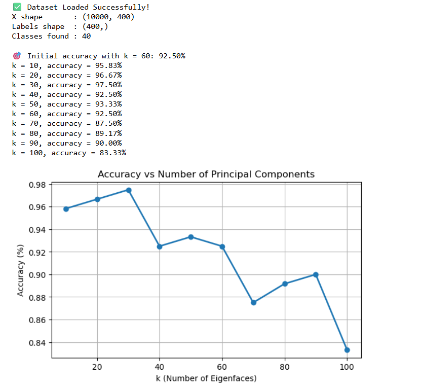
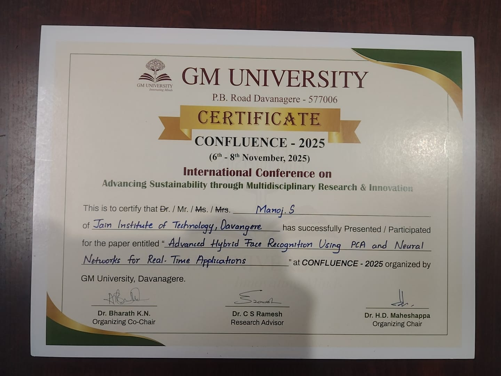

# Advanced AI-Powered Face Recognition using PCA & Neural Networks

## Project Overview
This project implements an advanced face recognition system using Principal Component Analysis (PCA) for dimensionality reduction and Artificial Neural Networks (ANN) for classification.

The system extracts important facial features from images and improves recognition accuracy while reducing computational complexity.

## Technologies Used
- Python
- OpenCV
- NumPy
- Scikit-learn
- Matplotlib

## Dataset
This project uses the **AT&T ORL Face Dataset**.
Dataset Details:
- 40 individuals
- 10 images per person
- Total images: 400
- Grayscale facial images

Dataset Link:  
https://cam-orl.co.uk/facedatabase.html

## Key Features
- Face detection using OpenCV
- Feature extraction using PCA
- Face classification using Neural Networks
- Improved recognition speed and accuracy

## Methodology
The system follows the following pipeline:
1. Load face images from dataset
2. Convert images to grayscale
3. Resize images for uniform processing
4. Apply Principal Component Analysis (PCA) to extract eigenfaces
5. Generate facial feature signatures
6. Train Artificial Neural Network classifier
7. Perform face recognition prediction

## Project Workflow
1. Image Dataset Collection
2. Image Preprocessing
3. Feature Extraction using PCA
4. Neural Network Training
5. Face Recognition Prediction

## Model Performance

### Accuracy vs Number of Eigenfaces

Best accuracy achieved: **97.5% using 30 principal components.**

## Applications
- Security Systems
- Smart Attendance Systems
- Biometric Authentication
- Surveillance Systems

## Conference Presentation

This project is based on the research paper titled **"Advanced Hybrid Face Recognition Using PCA and Neural Networks for Real-Time Applications"**, which was successfully **presented at the International Conference – CONFLUENCE 2025** held at **GM University, Davanagere (6th–8th November 2025)**.

The conference focused on **Advancing Sustainability through Multidisciplinary Research & Innovation**.

## Conference Presentation

This project is based on the research paper titled **"Advanced Hybrid Face Recognition Using PCA and Neural Networks for Real-Time Applications"**.

The research work was successfully presented at the **International Conference – CONFLUENCE 2025** held at **GM University, Davanagere (6–8 November 2025)**.

## Conference Certificate

## Author
Manoj S  
AI & ML Enthusiast
